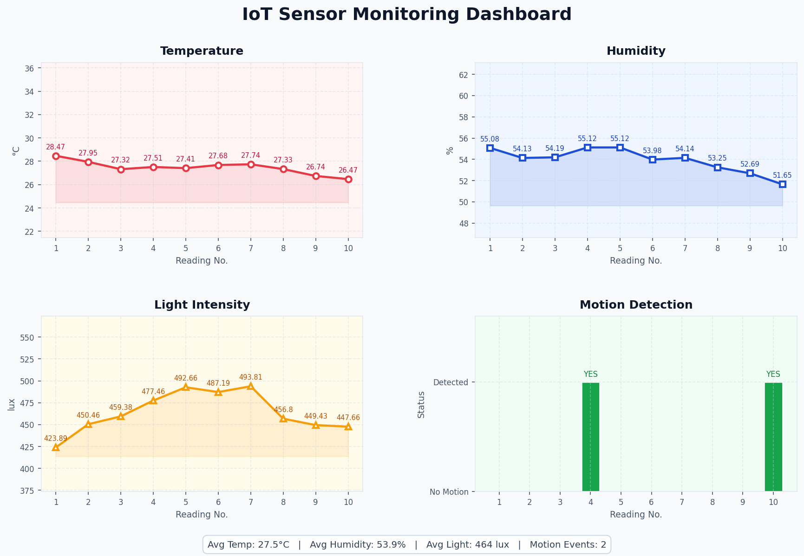
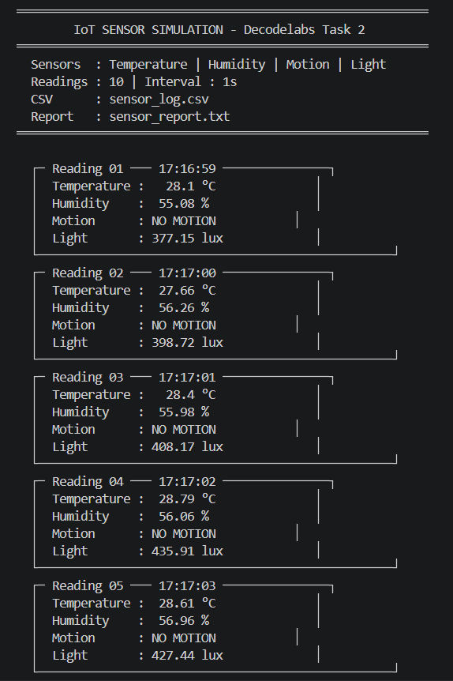
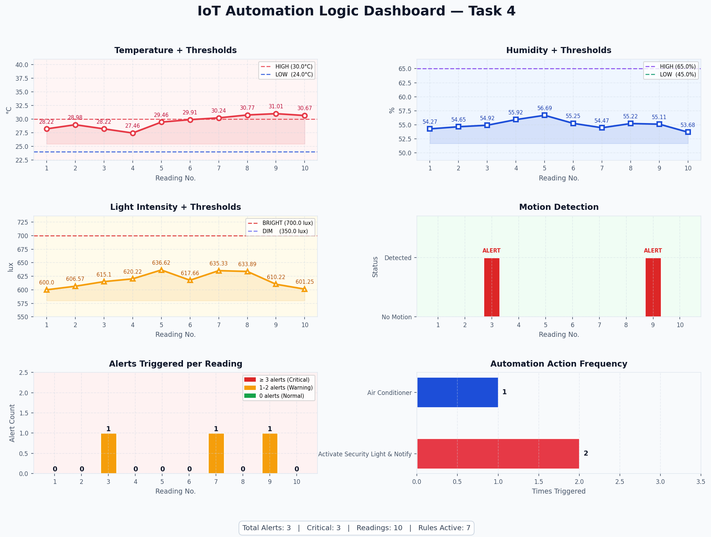
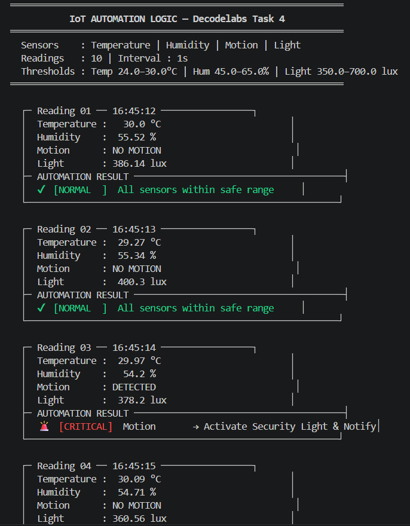
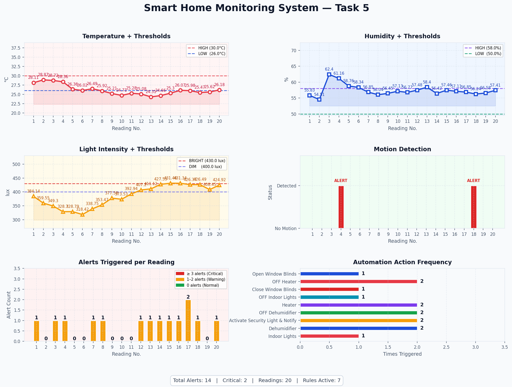
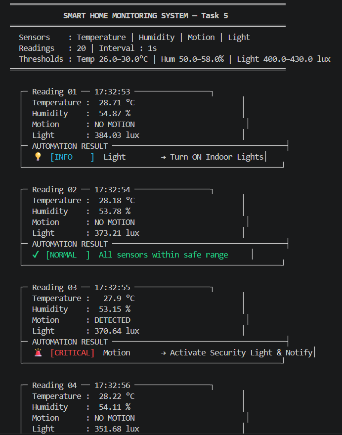

# 🌐 IoT: Building Intelligent Systems
### Decodelabs Summer Internship 2026 — N Vishal

> All 5 tasks completed | Language: **Python 3** | Library: **Matplotlib**


---

## 📋 Table of Contents

- [Project Overview](#project-overview)
- [Repository Structure](#repository-structure)
- [Screenshots](#screenshots)
- [Task 1 — Introduction to IoT & Device Communication](#task-1--introduction-to-iot--device-communication)
- [Task 2 — Sensor Data Simulation](#task-2--sensor-data-simulation)
- [Task 3 — IoT Data Monitoring Dashboard](#task-3--iot-data-monitoring-dashboard)
- [Task 4 — IoT Automation Logic](#task-4--iot-automation-logic)
- [Task 5 — IoT Mini Project: Smart Home Monitoring System](#task-5--iot-mini-project-smart-home-monitoring-system)
- [How to Run](#how-to-run)
- [Requirements](#requirements)
- [Output Files](#output-files)

---

## Project Overview

This repository contains all 5 tasks completed during the **Decodelabs IoT Summer Internship 2026**.
The project covers the full IoT pipeline — from understanding architecture and communication protocols,
to simulating multi-sensor data, visualizing it on a live dashboard, implementing rule-based automation
logic, and combining everything into a stateful Smart Home Monitoring System.

---

## Repository Structure

```
decodelabs-_tasks/
│
├── first_task_IoT/                   # Task 1 — IoT Introduction (PDF Presentation)
│
├── second_and_third_task_IoT/        # Task 2 + Task 3 — Sensor Simulation & Dashboard
│   ├── sensor_simulation_code.py
│   ├── sensor_log.csv
│   ├── sensor_report.txt
│   └── iot_dashboard.png
│
├── fourth_task_IoT/                  # Task 4 — Automation Logic Engine
│   ├── automation_engine_code.py
│   ├── automation_log.csv
│   ├── automation_report.txt
│   ├── automation_alerts.txt
│   └── automation_dashboard.png
│
├── fifth_task_IoT/                   # Task 5 — Smart Home Mini Project
│   ├── smart_home_mini_code.py
│   ├── smart_home_log.csv
│   ├── smart_home_report.txt
│   ├── smart_home_alerts.txt
│   └── smart_home_dashboard.png
│
├── screenshots/                      # All dashboard + terminal output screenshots
│   ├── iot_dashboard.png
│   ├── automation_dashboard.png
│   ├── smart_home_dashboard.png
│   ├── terminal_sensor_simulation.png
│   ├── terminal_automation.png
│   └── terminal_smart_home.png
│
├── .gitignore
├── requirements.txt
└── README.md
```

---

## Screenshots

### Task 2 & 3 — Sensor Simulation Dashboard


### Task 2 & 3 — Terminal Output


### Task 4 — Automation Logic Dashboard


### Task 4 — Terminal Output (with colour-coded severity)


### Task 5 — Smart Home Dashboard


### Task 5 — System Health Report (Terminal)


---

## Task 1 — Introduction to IoT & Device Communication

**Folder:** `first_task_IoT/`
**Deliverable:** PDF Presentation — *"IoT: Building Intelligent Systems"*

A structured presentation covering the theoretical foundation of IoT systems.

**Topics covered:**

| Slide | Content |
|-------|---------|
| Core Concepts | IoT defined as a network of devices collecting, exchanging, and processing data via sensors, networks, and cloud |
| IoT Ecosystem Layers | Device Layer (Arduino/Raspberry Pi) → Network Layer (Wi-Fi, Bluetooth, Zigbee, MQTT) → Cloud Layer (AWS IoT, Azure IoT Hub) |
| Communication Workflow | Sensor → Gateway → Cloud → Analytics → Mobile App → Device Action |
| Practical Applications | Smart Parking System, Smart Waste Management |
| IoT Across Sectors | Agriculture, Transportation, Smart Buildings, Environmental Monitoring, Healthcare, Manufacturing |
| Core Design Principle | Input (Sensor) → Processing (Controller/Cloud) → Output (Action) |
| Conclusion | Smart Automation, Real-Time Monitoring, and Future Scope in Industry 4.0 |

**Key Skills:** IoT fundamentals, system architecture, communication protocols

---

## Task 2 — Sensor Data Simulation

**Folder:** `second_and_third_task_IoT/`
**File:** `sensor_simulation_code.py`

Simulates 4 IoT sensors using a **stateful random-walk model** — values drift realistically between
readings rather than jumping randomly, with a small chance of sudden spikes.

**Sensors Simulated:**

| Sensor | Range | Start Value | Behavior |
|--------|-------|-------------|----------|
| Temperature | 20–40 °C | 28.0 °C | ±0.8 drift/reading, 3% spike chance |
| Humidity | 30–90 % | 55.0 % | ±1.2 drift/reading, 3% spike chance |
| Light | 0–1000 lux | 400.0 lux | ±40 drift/reading, 3% spike chance |
| Motion | 0 / 1 | — | 20% detection probability with 2-reading cooldown |

**Configuration** (editable at the top of the file):
```python
TOTAL_READINGS   = 10   # Number of sensor readings
INTERVAL_SECONDS = 1    # Delay between readings (seconds)
```

**Output files generated:**
- `sensor_log.csv` — all readings in tabular format
- `sensor_report.txt` — formatted box-styled text report with per-reading data + summary statistics

**Key Skills:** Stateful simulation, CSV logging, formatted file output

---

## Task 3 — IoT Data Monitoring Dashboard

**Folder:** `second_and_third_task_IoT/`
**File:** `sensor_simulation_code.py` *(dashboard generated at end of same script)*

After all readings are collected, a **4-panel Matplotlib dashboard** is generated and saved.

**Dashboard Panels:**

| Panel | Chart Type | Color |
|-------|-----------|-------|
| Temperature | Line + area fill + data labels | Red (`#e63946`) |
| Humidity | Line + area fill + data labels | Blue (`#1d4ed8`) |
| Light Intensity | Line + area fill + data labels | Amber (`#f59e0b`) |
| Motion Detection | Bar chart (green = none, dark green = detected) | Green |

A summary footer displays averages and motion event count across the session.

**Output file generated:**
- `iot_dashboard.png` — saved at 150 DPI

**Key Skills:** Matplotlib, GridSpec layout, data visualization, monitoring dashboards

---

## Task 4 — IoT Automation Logic

**Folder:** `fourth_task_IoT/`
**File:** `automation_engine_code.py`

Builds a rule-based **Automation Engine** on top of the sensor simulator.
Rules are evaluated every reading — when a threshold is crossed, a device action fires and is logged.

**Automation Rules (7 active):**

| Condition | Action | Severity |
|-----------|--------|----------|
| Temperature > 30 °C | Turn ON Air Conditioner | 🔴 CRITICAL |
| Temperature < 24 °C | Turn ON Heater | 🔵 WARNING |
| Temperature cools below 28 °C (AC was ON) | Turn OFF Air Conditioner | ℹ️ INFO |
| Humidity > 65 % | Turn ON Dehumidifier | 💧 WARNING |
| Humidity < 45 % | Turn ON Humidifier | 🏜️ WARNING |
| Light < 350 lux | Turn ON Indoor Lights | 💡 INFO |
| Light > 700 lux | Close Window Blinds | ☀️ INFO |
| Motion Detected | Activate Security Light & Notify | 🚨 CRITICAL |

**Design feature:** AC uses state memory — it turns ON once and stays ON until temperature
drops back below 28 °C, preventing repeated alerts on every reading.

**Output files generated:**
- `automation_log.csv` — readings + alert count + triggered actions per row
- `automation_report.txt` — full per-reading report with automation results + summary
- `automation_alerts.txt` — dedicated alert-only log
- `automation_dashboard.png` — 6-panel dashboard including alert count per reading and action frequency chart

**Key Skills:** Rule engine design, severity classification, state machines, event logging

---

## Task 5 — IoT Mini Project: Smart Home Monitoring System

**Folder:** `fifth_task_IoT/`
**File:** `smart_home_mini_code.py`

A complete end-to-end Smart Home simulation combining all learned concepts, with three
key upgrades over Task 4.

**Upgrades over Task 4:**

**1. Full Device State Memory**
All 6 devices (AC, Heater, Dehumidifier, Humidifier, Lights, Blinds) are tracked independently.
Alerts fire **only on state transitions** (OFF→ON or ON→OFF) — eliminates alert spam.

**2. Device Feedback Loop**
Physically realistic simulation: when the humidifier is ON it adds +1.5% humidity per reading;
when the dehumidifier is ON it subtracts 1.5%. Devices actively affect the environment.

**3. System Health Report**
At the end of each session, an overall verdict is printed in plain English:

| Verdict | Condition |
|---------|-----------|
| 🔴 CRITICAL | At least one CRITICAL alert fired |
| 🟡 WARNING | At least one WARNING alert (no CRITICAL) |
| ✅ NORMAL | All sensors stayed within safe limits |

Also identifies the most active sensor and prints a per-sensor alert breakdown to the terminal.

**Configuration:**
```python
TOTAL_READINGS   = 20   # Extended session (double Task 4)
INTERVAL_SECONDS = 1
```

**Output files generated:**
- `smart_home_log.csv`
- `smart_home_report.txt` — includes System Health Report section
- `smart_home_alerts.txt`
- `smart_home_dashboard.png` — 6-panel dashboard

**Key Skills:** End-to-end IoT workflow, stateful device simulation, feedback loops, health reporting

---

## How to Run

**1. Clone the repository:**
```bash
git clone https://github.com/SnipeVeniom/decodelabs-_tasks.git
cd decodelabs-_tasks
```

**2. Install dependencies:**
```bash
pip install -r requirements.txt
```

**3. Run individual tasks:**
```bash
# Task 2 + Task 3 (Sensor Simulation + Dashboard)
python second_and_third_task_IoT/sensor_simulation_code.py

# Task 4 (Automation Logic Engine)
python fourth_task_IoT/automation_engine_code.py

# Task 5 (Smart Home Monitoring System)
python fifth_task_IoT/smart_home_mini_code.py
```

> All output files (CSV, TXT reports, PNG dashboards) are saved in the same directory as the script.

---

## Requirements

Only one external dependency:

```
matplotlib
```

Install with:
```bash
pip install -r requirements.txt
```

Standard library modules used: `random`, `csv`, `time`, `datetime`

---

## Output Files

| Task | CSV | Text Report | Alert Log | Dashboard (PNG) |
|------|-----|-------------|-----------|-----------------|
| Task 2 & 3 | `sensor_log.csv` | `sensor_report.txt` | — | `iot_dashboard.png` |
| Task 4 | `automation_log.csv` | `automation_report.txt` | `automation_alerts.txt` | `automation_dashboard.png` |
| Task 5 | `smart_home_log.csv` | `smart_home_report.txt` | `smart_home_alerts.txt` | `smart_home_dashboard.png` |

---

## 🔗 Internship

**Organization:** [Decodelabs](https://www.decodelabs.tech)
**Program:** IoT Summer Internship 2026
**Author:** N Vishal
**LinkedIn:** [decodelabs](https://linkedin.com/company/decodelabs)
**Telegram:** [t.me/decodelabs_tech](https://t.me/decodelabs_tech)
